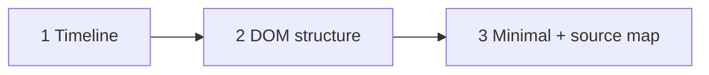

# Slate #5989 — exploration hypotheses (learning, not fixing)

App-layer patches (minimal / end-only / fixed / alt-a/b/c) are **retired**. Device gate
(2026-07-21): all produced `ㄱ가나다` on AF — identical `events[]`. We cannot fix what we
do not yet **model**.

This doc proposes three **exploration tracks** — questions into territory we have not
instrumented yet. Success = a clearer causal story, not green tests.

---

## What we know (stop re-proving)

| Fact | Fixture / evidence |
| ---- | ------------------ |
| AF broken continuous typing ≈ readable except leading `ㄱ` | `device-broken-가나다가나다-continuous.json` |
| `compositionend.data` correct; DOM keeps orphan `ㄱ` | all `device-alt-gate-*.json` |
| Plain textarea same device OK | `fixed-가-plain-control.json` |
| Vitest replay matchRate ≪ 1 (first mismatch ~beforeinput #3) | `SlateLogger.ime.replay-fidelity.test.tsx` |
| Editable wrappers (hide placeholder, guard, anchor) change nothing | `device-alt-gate-alt-{a,b,c}.json` |

**Open question:** At which **layer** (Selection? DOM node? Slate op? Android IM diff?) does
the first `ㄱ` become **non-replaceable** when IME `data` advances to `가`?

---

## Hypothesis 1 — Divergence timeline (model vs DOM vs IME)

**Question:** On the device, *when* do `Node.string(editor)`, `editable.textContent`, and
`events[].value` first disagree — and does that moment precede or follow orphan `ㄱ`?

**Uncharted:**

- We only snapshot `slateDebug.final` at download (passive).
- `fixTrace` was patch-action-centric, not event-aligned.
- Experiment B (`dualTraceFromImeCapture`) exists in `@siheom/ime` but we never exported
  **per-event** Slate+selection reads from the Story on AF.

**Explore:**

1. Add **passive, deferred** snapshot on `compositionupdate` / `beforeinput` / `compositionend`
   (microtask — never sync in handler) → `slateDebug.timeline[]` aligned with `events[]` index.
2. Include: `slateText`, `domText`, `selection` offsets, `isComposingWeak`, `isComposingReact`,
   `placeholderPresent`, `placeholderDisplay`, `pendingDiffCount` (if readable safely).
3. Diff timeline[i] vs events[i].value — find **first index** where DOM value is `ㄱ` but
   `compositionupdate.data` is already `가`.

**Learn:** Is orphan `ㄱ` a **Slate model** artifact, **DOM-only** IME state, or **both out of sync**?

**Not:** Another rewrite rule keyed off `data`.

---

## Hypothesis 2 — Structural diff (Slate DOM vs plain control at same instant)

**Question:** What DOM structure does IME see in Slate that textarea does not — at the
**first** `insertCompositionText` with `data: "ㄱ"`?

**Uncharted:**

- Side-by-side captures compare **final text**, not **DOM shape at t₀**.
- Slate placeholder = `[data-slate-placeholder]` + `contenteditable=false` + often `\uFEFF`
  in adjacent text node (from Slate source comments) — we never captured **innerHTML /
  childNode list** at first keydown on device.
- Linux Slate works; Android doesn't — we haven't diffed **code path** (desktop skips
  `androidInputManager`) vs **DOM shape**.

**Explore:**

1. Story layout: **Slate + textarea** same screen, one JSON, two `scenarioId` sections or
   linked traces — type `가` once in each field (controlled session).
2. At first `beforeinput` (deferred): record compact `domStructure` — tag names, `data-slate-*`,
   `contenteditable` flags, text node lengths (no full clone if too heavy).
3. Compare AF capture to Linux capture **structure**, not just outcome.

**Learn:** Is orphan `ㄱ` correlated with placeholder leaf still in tree, FEFF leaf, or
selection anchored on zero-width node?

**Not:** Removing placeholder API (already rejected decorative path).

---

## Hypothesis 3 — Minimal surface + source map (below React)

**Question:** Can orphan `ㄱ` be reproduced **below** our Story stack — static DOM or
Vitest first-mismatch step — and mapped to a **named function** in `android-input-manager`?

**Uncharted:**

- Replay fidelity tells us step 3 diverges; we never built **minimal HTML** with Slate's
  post-render DOM shape (placeholder span + empty text) without React reconciliation.
- We haven't read `storeDiff` / `handleCompositionText` with our **exact** event sequence
  annotated line-by-line.
- Golden writeback on plain CE = 100% → the **event stream is self-consistent**; Slate mount
  is what breaks predictability.

**Explore:**

1. **Static fixture:** HTML file mimicking Slate empty+placeholder DOM (from device
   `domStructure` once H2 lands) — manual Hangul on AF browser, no React.
2. **Source map doc:** For events[0..15] of `device-alt-gate-broken-가나다.json`, trace which
   `android-input-manager` handlers would fire and what they assume about selection length.
3. **Vitest as oracle:** Treat firstMismatch index as a **spec** — "at step 3 DOM already `ㄱ`";
   minimal DOM fixture should reproduce or falsify.

**Learn:** Is the bug **React/Slate reconciliation**, **Android IM diff logic**, or **browser
IME + DOM shape** alone?

**Not:** Another Editable prop patch without the map above.

---

## Suggested order

1. **H1** cheapest in Story (extend capture JSON).
2. **H2** needs dual-field UI + one device session.
3. **H3** synthesizes H1+H2 into upstream conversation / Slate issue.

---

## Archive

Retired fix/explore modes and gate results:
[`slate-placeholder-fix-alternatives.md`](./slate-placeholder-fix-alternatives.md)

Mechanism notes:
[`slate-placeholder-hangul-mechanism.md`](./slate-placeholder-hangul-mechanism.md)
