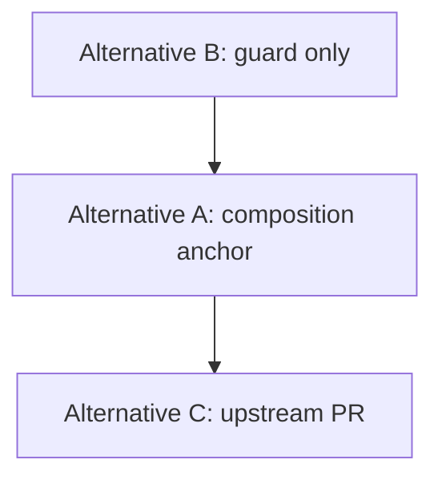

# Slate #5989 — natural fix alternatives (post experiment)

After device captures on Android Firefox (2026-07-21), we removed app-layer patch
modes (`minimal`, `end-only`, `fixed`). They either fought IME DOM, felt like post-hoc
rewrite, or were worse than upstream **broken** Slate.

**Broken baseline (what actually happens):**

- Continuous Hangul input works except one **stuck leading choseong** (`ㄱ가나다가나다`).
- `compositionend.data` is correct (`가나다가나다`); DOM keeps orphan `ㄱ`.
- Plain `<textarea>` on the same device is fine → bug is Slate Android + placeholder path.

**Rejected app patches (keep fixtures, do not re-ship):**

| Patch | Why rejected |
| ----- | ------------ |
| Preedit drive (`onDOMBeforeInput` + `replaceSlateEditorPlainText`) | Pure function matched device but driving DOM each step exploded |
| Force-render guard + `compositionstart` select reset | 2nd session DOM wipe → garbage |
| `compositionend` orphan-ㄱ strip | Final text OK; typing UX wrong (see `ㄱ…` then magic fix) |

---

## Alternative A — Composition anchor (Slate-side, no text rewrite)

**Idea:** First IME input must target a **real empty text node**, not the placeholder
leaf (`contenteditable=false`, often with `\uFEFF`). Orphan `ㄱ` appears because
composition starts in the wrong DOM slot.

**Mechanism:**

1. Hide official placeholder on **first `keydown` (229 / Process)** — before
   `compositionstart` (Firefox Android is late on React `isComposing`).
2. Do **not** `Transforms.select(start)` when the document already has text (device:
   that wiped DOM between words).
3. Optional: ensure paragraph child is `{ text: '' }` without FEFF before first compose.

**Natural because:** Matches how plain CE works — IME talks to one editable text surface.
No mid-compose model overwrite.

**Validate:** Device AF — first syllable shows `가` during compose, not `ㄱ`; continuous
`가나다가나다` without leading jamo.

**Likely home:** `slate-react` `Editable` / `android-input-manager` or thin Story wrapper
that only adjusts placeholder timing + selection once.

---

## Alternative B — Trust Android IM DOM (guard only, zero document drive)

**Idea:** Slate's `androidInputManager` is designed to **own live preedit in the DOM**
via `storeDiff`. Broken continuous typing already builds `ㄱ가나다…` correctly until
commit semantics; explosions came from **our** `replaceSlateEditorPlainText` and
select-reset, not from upstream alone.

**Mechanism:**

1. While `IS_COMPOSING`, never call `EDITOR_TO_FORCE_RENDER` (MutationObserver re-render
   wipes IME — documented in Slate source comments).
2. Never rewrite Slate document text during `beforeinput` / `compositionupdate`.
3. Do not attach custom `onDOMBeforeInput` handlers that `preventDefault` composition inserts.

**Natural because:** Lets the browser IME and Slate Android layer do their job; app only
blocks the one harmful reconciliation path (force-render during compose).

**Validate:** Same as broken for `가나다가나다`, but **without** patch-induced session-2
wipe. Still leaves orphan `ㄱ` → pair with A or C for that last mile.

**Likely home:** Small hook wrapping `EDITOR_TO_FORCE_RENDER` only; no Editable prop overrides
except maybe `renderPlaceholder` hide while composing.

---

## Alternative C — Upstream Slate fix (#5989)

**Idea:** Fix in **slate-react** where placeholder + Android composition intersect, with
device fixtures as regression tests in Slate's repo.

**Targets (from mechanism notes + device logs):**

- Placeholder visibility vs `showPlaceholder` when Android never flips React `isComposing`.
- `handleDomMutations` / force-render policy during composition preedit.
- Composition range when placeholder leaf is adjacent to empty text node (AC jamo-split, AF
  stuck-ㄱ).

**Natural because:** Consumers keep `placeholder={…}` with no app-specific Hangul hacks;
Linux desktop already works with the same API.

**Validate:** Slate PR + our golden JSON replays (knowing Vitest fidelity ≪ 1 for AF — device
is gate).

**Deliverable:** Minimal PR to [ianstormtaylor/slate](https://github.com/ianstormtaylor/slate/issues/5989)
+ `fixtures/android-firefox/device-broken-*.json` as external repro.

---

## Recommended order

1. **B** — confirm broken+guard does not regress continuous typing (no new wipe).
2. **A** — fix orphan `ㄱ` at the source (first compose slot).
3. **C** — generalize what A+B prove into Slate core.

Do **not** revisit end-only / preedit-drive unless a new device capture shows a failure mode
that A/B cannot explain.
